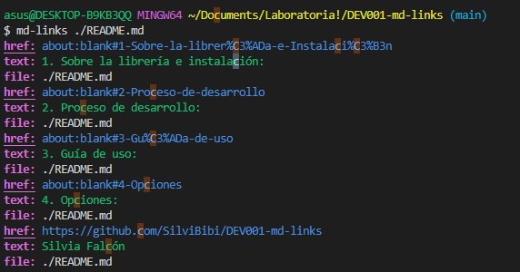
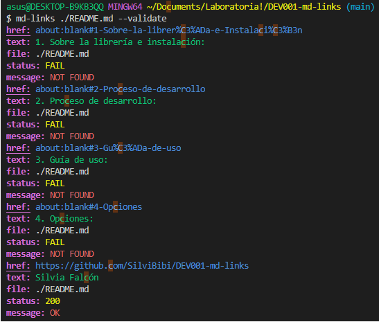
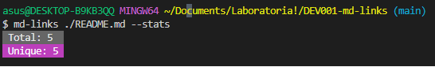
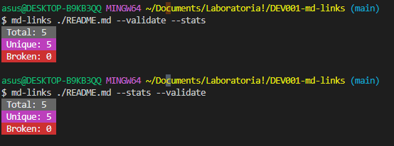
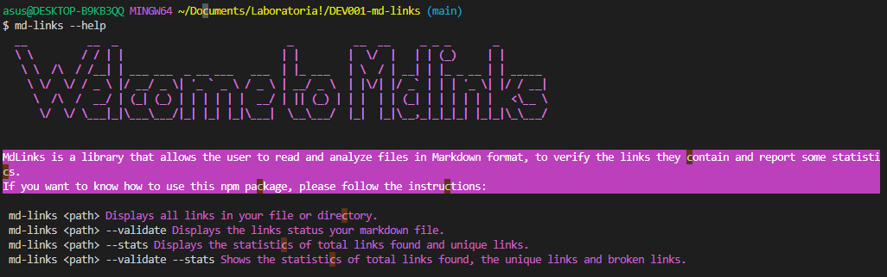

#  Markdown Links 🔗

## Index

* [1. About the library and installation:](#1-About-the-library-and-installation)
* [2. Development process:](#2-Development-process)
* [3.User guide:](#3-User-guide)
* [4. Options:](#4-Options)

 
***


## 1. About the library and installation 💻
It is an executable library with node.js, capable of reading and analyzing files in Markdown format, to verify the links they contain and report some statistics. 

#### Installation
You can do the installation by `npm`:

```sh
npm install SilviBibi/DEV001-md-links
```

  ## 2. Development process:

Before starting the execution of this project, I planned my tasks and objectives, that is why I made a flowchart to capture what I wanted to achieve and how I could do it.


## 3. User guide 📖
In your terminal, you can run "md-links" and add a path, you will see in your **console or terminal**, the path of the file, link and the text that has the link. 
<code> md-links < path > </code>
  
* `href`: URL found.
* `text`: Text that appeared inside the link (`<a>`).
* `file`: Path of the file where the link was found.



## 4. Options
  <code> --validate </code> <code> --stats </code> <code> --validate --stats </code> <code> --stats --validate </code> 

### Validate
If you enter the option <code> --validate </code> you will can see the status of your links.
 
* `href`: URL found.
* `text`: Text that appeared inside the link (`<a>`).
* `file`: Path of the file where the link was found.
* `status`:  HTTP response code.
* `ok`: Message 'fail' in case of failure or 'ok' in case of success.



#### --Stats
If you enter the option <code> --stats </code> you will can see the basic statistics about links.



#### --Validate --Stats o --Stats --Validate
You can also enter <code> --validate --stats </code>  o <code> --stats --validate </code> to obtain statistics that require validation results.



#### --Help
You can also enter <code> md-links --help </code> for help regarding how to use this library.



   **Author**
  [Silvia Falcón](https://github.com/SilviBibi/DEV001-md-links)
  
